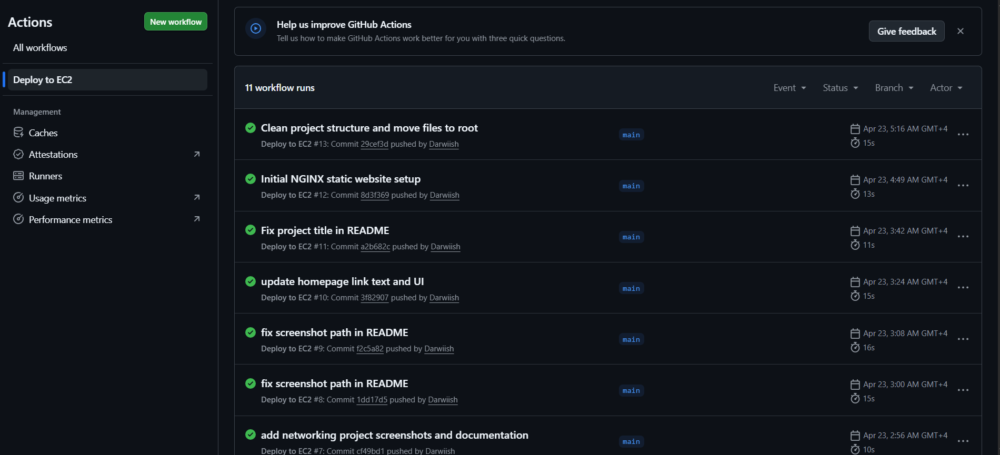
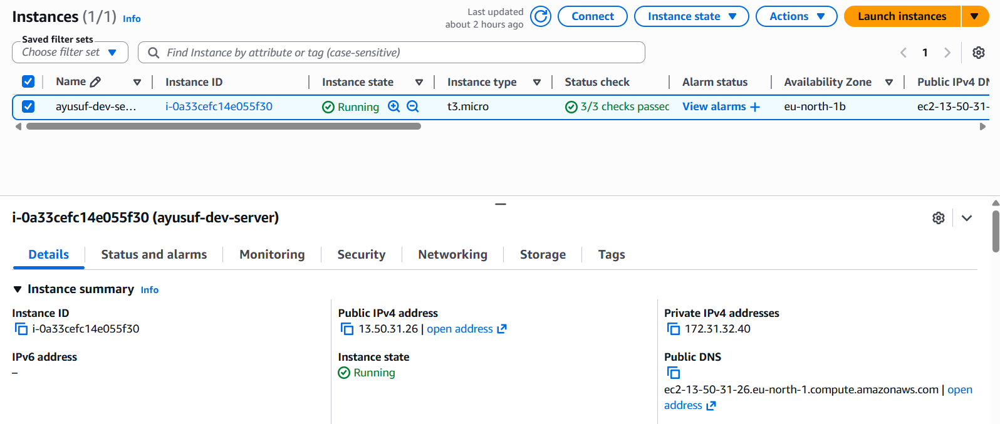
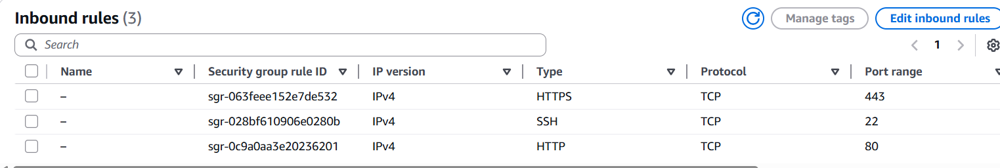
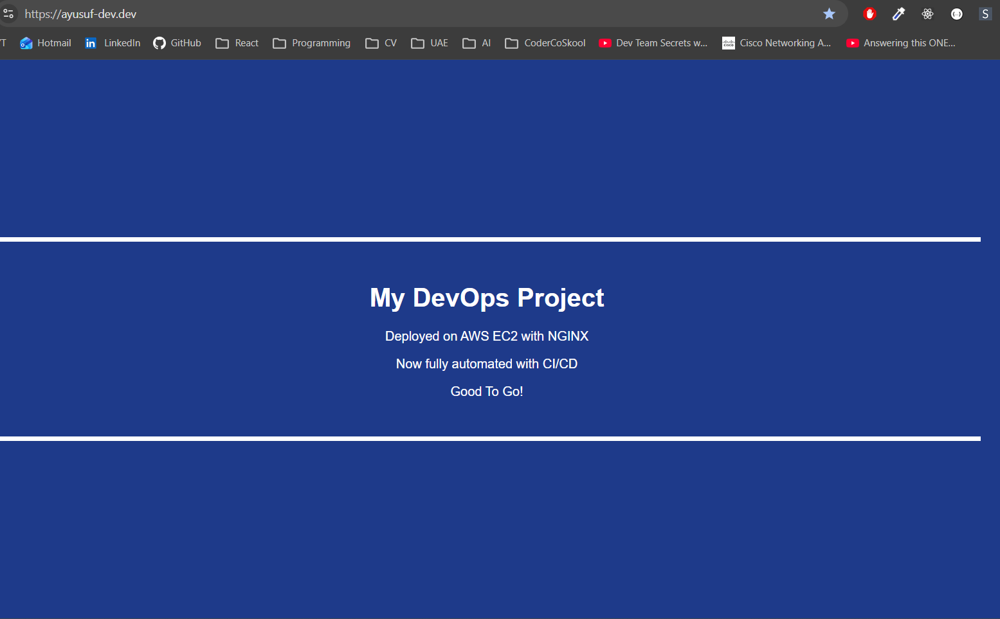

# NGINX Domain Hosting Project

## Overview
This project demonstrates hosting a static website on an AWS EC2 instance using NGINX and connecting it to a custom domain.

---

## What I built

- Deployed EC2 instance on AWS
- Installed and configured NGINX
- Deployed custom HTML website
- Configured DNS A record for domain mapping
- Enabled public access over HTTP/HTTPS
- Implemented CI/CD pipeline for automated deployment

---

## Deployment Flow

Domain → DNS (Cloudflare) → EC2 Public IP → NGINX → Website

---

## CI/CD Pipeline (GitHub → EC2 Deployment)

This project implements a CI/CD pipeline using GitHub Actions to automate deployment to an AWS EC2 instance.

### How it works

1. Code is pushed to the `main` branch  
2. GitHub Actions workflow is triggered  
3. The workflow connects to the EC2 instance via SSH  
4. Latest code is pulled from the GitHub repository  
5. NGINX is reloaded to apply updates  
6. Changes are reflected live on the website  

### CI/CD Pipeline Execution

---

### Instance State

Shows the AWS EC2 dashboard with instance details including public IP and running state. Confirms that the EC2 instance is active and serving traffic.

---

### Security Group Configuration

Inbound rules allowing:
- HTTP (port 80) for web traffic  
- SSH (port 22) for remote access  

---

### Elastic IP Configuration

Elastic IP assigned to ensure a stable public address for domain mapping.

---

## Server Access

### SSH Connection to EC2

.png)

Secure remote access to the EC2 instance using SSH and key-based authentication.

---

## DNS Configuration

### Cloudflare DNS Setup

A record maps the custom domain to the EC2 public IP address.

---

## Website

A custom static HTML website hosted on an AWS EC2 instance and served using the NGINX web server.

The site is accessible via:
- EC2 public IP
- Custom domain

### Live Website

---

## Technologies Used

- AWS EC2
- NGINX
- Cloudflare DNS
- GitHub Actions (CI/CD)
- Linux (Amazon Linux 2023)
- HTML/CSS

---

## Result

A fully functional cloud-hosted website with:

- Automated CI/CD deployment  
- Public accessibility via domain and IP  
- Proper server and DNS configuration  

---

## Notes

All screenshots are stored in:

`networking/screenshots`
