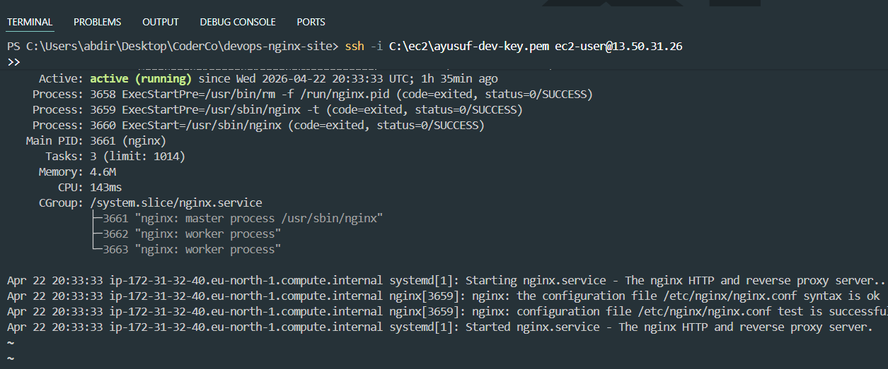

# NGINX Domain Hosting Project

## Overview
This project demonstrates hosting a static website on an AWS EC2 instance using NGINX and connecting it to a custom domain.

---

## What I built

- Deployed EC2 instance on AWS
- Installed and configured NGINX
- Deployed custom HTML website
- Configured DNS A record for domain mapping
- Enabled public access over HTTP/HTTPS

---

## Deployment Flow

Domain → DNS (Cloudflare) → EC2 Public IP → NGINX → Website

---

## CI/CD Pipeline (GitHub → EC2 Deployment)

This project uses a CI/CD pipeline to automatically deploy changes to an EC2 server.

### How it works

1. Code is pushed to the `main` branch
2. GitHub Actions is triggered
3. Connects to EC2 via SSH
4. Pulls latest code
5. Reloads NGINX
6. Website updates instantly

---

## Evidence (Step-by-step)

### 1. CI/CD Pipeline Success

---

### 2. DNS Configuration (Cloudflare)

---

### 3. SSH Access to EC2

.png)

---

### 4. Live Website

---

### 5. NGINX Running

---

## Technologies Used

- AWS EC2
- NGINX
- Cloudflare DNS
- GitHub Actions (CI/CD)
- Linux (Amazon Linux 2023)
- HTML/CSS

---

## Result

The website is accessible via:

- Public IP
- Custom Domain

---

## Notes

All screenshots are stored in:

`networking/screenshots`
